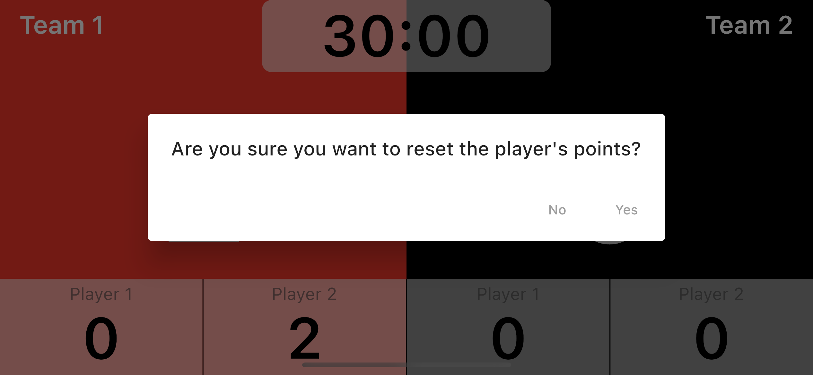

# Приложение для Новосибирского крокет клуба

### Функционал:
- Возможен выбор времени игры 30, 20, 15, 10 или 5 минут;
- Для увеличения очков игрока нажать на серый прямоугольник с именем игрока;
- Для уменьшения очков на 1, необходимо "смахнуть" игрока влево, затем нажать на кнопку "минус";
- Для сброса очков игрока, необходимо зажать серый прямоугольник с именем игрока, после чего появится предупреждающий диалог;
- После завершения игры, появляется диалоговое окно с информацией об игре.

### Скриншоты приложения

Действия

Локализация

Экран настроек

Диалоговое окно при сбросе очков

Диалоговое окно при завершении игры

### Terminal comand
For localization:
flutter pub run easy_localization:generate -S "assets/translations"
flutter pub run easy_localization:generate -f keys -o locale_keys.g.dart -S "assets/translations"
